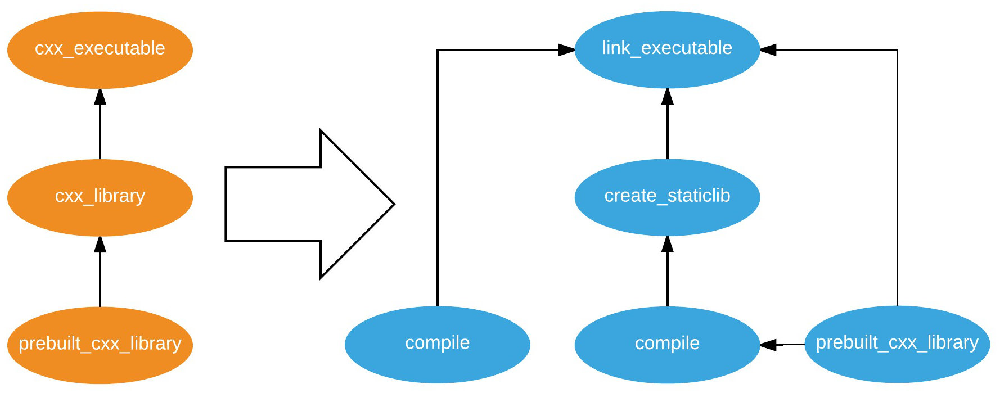

# The Craftr build system (version 3.x)

Craftr is a language-agnostic build system implemented in Python 3.6. It is
built on top of the [Node.py] runtime and leverages the **nppm** package
manager. This allows you to install the exact version of Craftr that you need
to get a fully reproducible build, and also make use of other modules and
their build definitions.

This new version of Craftr is largely inspired by the way [Buck] represents
the build graph as targets that are then translated into actions.

  [Node.py]: https://nodepy.org
  [Buck]: https://buckbuild.com/
